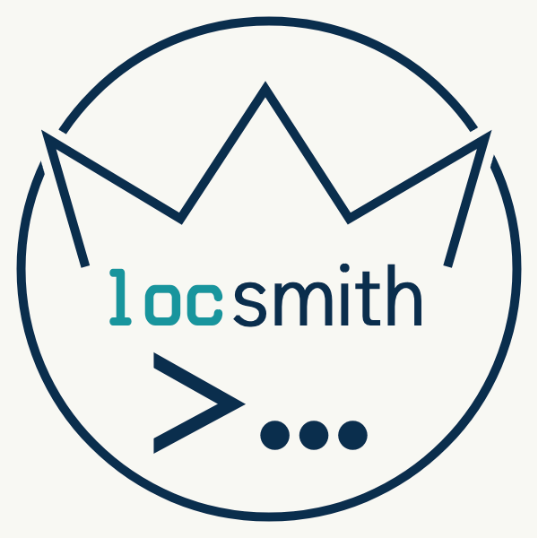

<div align="center">
    
</div>

# LOCsmith

A fast Bash utility that counts lines of code in your projects.

## Installation

```bash
curl -fsSL https://raw.githubusercontent.com/fccview/locsmith/main/install.sh | bash -s -- --remote
```

Or clone the repo and install locally:

```bash
bash install.sh
```

Both create `~/.locsmith/` and link `locsmith` to `~/.local/bin/`.

## Usage

```bash
locsmith                              # scan current directory
locsmith --ignore node                # skip prompts, use an ignore profile
locsmith --dir ~/projects/app         # scan a specific directory
locsmith --ignore-file .myignore      # use a custom ignore file
locsmith --help --ignores             # list available ignore profiles
locsmith --update                     # update to latest release
```

## Ignore Profiles

Drop `.ignore` files into `~/.locsmith/ignore/`:

```
# ~/.locsmith/ignore/node.ignore
node_modules
.next
dist
build
coverage
```

Each line is a pattern passed to `find -prune`. 
Supports exact names (`node_modules`), globs (`*.lock`), and paths (`public/*.js`).
